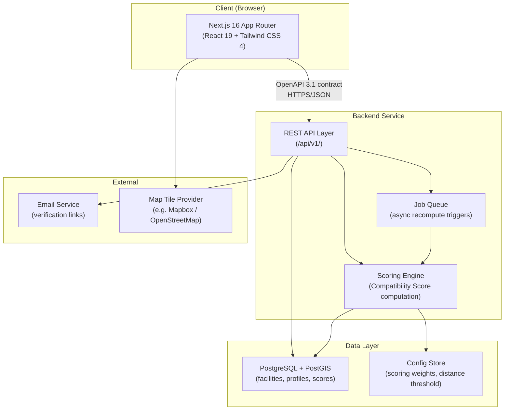
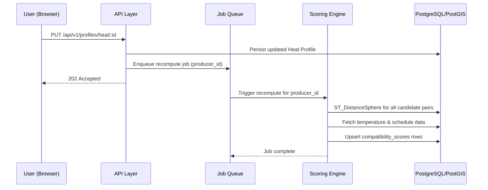
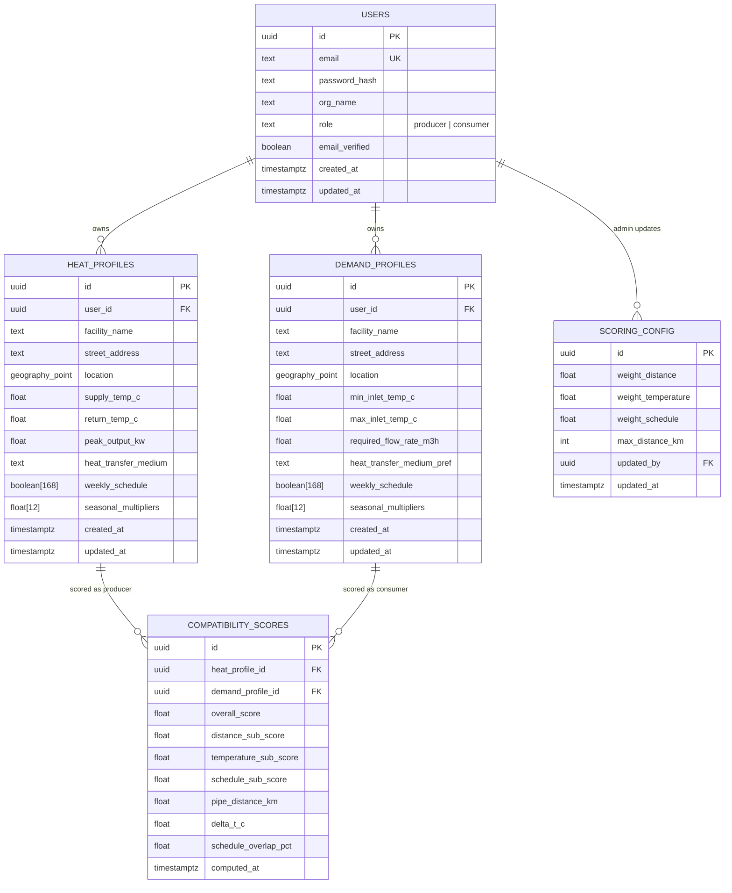

# Design Document: Industrial Heat Waste Recovery Optimizer (IHWRO)

## Overview

The Industrial Heat Waste Recovery Optimizer (IHWRO) is a proximity-aware web platform that connects industrial heat producers with nearby heat consumers. The system ingests structured heat output and demand profiles, computes a weighted Compatibility Score for every viable Producer–Consumer pair, and surfaces ranked match results through a dashboard with map visualization.

The MVP serves two primary personas:
- **Producer operations managers** — submit heat output profiles, view ranked Consumer matches
- **Consumer operations managers** — submit demand profiles, view ranked Producer matches

The platform is built on a Next.js 16 frontend (App Router, React 19, Tailwind CSS 4), a Python/FastAPI backend (served by Uvicorn), and a PostgreSQL database with the PostGIS extension for spatial queries. All data operations are exposed through a versioned RESTful API (`/api/v1/`) described by an OpenAPI 3.1 specification that FastAPI auto-generates from Pydantic models.

---

## Architecture

### High-Level System Architecture



### Request Flow — Score Computation



### Deployment Topology

The frontend is deployed as a Next.js application (App Router with React Server Components). The backend runs as a separate Python/FastAPI service (served by Uvicorn). Both share the same PostgreSQL + PostGIS instance. A lightweight job queue (Arq backed by Redis, or Celery with Redis broker) handles asynchronous score recomputation triggered by profile updates.

---

## Components and Interfaces

### Frontend Components (Next.js App Router)

```
src/app/
├── (auth)/
│   ├── register/
│   │   └── page.js          # Registration form (role selection)
│   ├── login/
│   │   └── page.js          # Login form
│   └── verify-email/
│       └── page.js          # Email verification prompt
├── (dashboard)/
│   ├── layout.js            # Authenticated shell with nav
│   ├── dashboard/
│   │   └── page.js          # Match Discovery Dashboard (list + map)
│   ├── profile/
│   │   ├── heat/
│   │   │   └── page.js      # Heat Profile creation/edit form
│   │   └── demand/
│   │       └── page.js      # Demand Profile creation/edit form
│   └── matches/
│       └── [matchId]/
│           └── page.js      # Match detail panel (sub-score breakdown)
├── admin/
│   └── config/
│       └── page.js          # Admin: scoring weights + distance threshold
└── api/                     # Next.js Route Handlers (proxy / BFF layer)
    └── v1/
        └── [...path]/
            └── route.js     # Forwards to backend service
```

**Key frontend components:**

| Component | Responsibility |
|---|---|
| `MatchDashboard` | Renders ranked match list + map; handles filter state |
| `MatchCard` | Displays counterpart name, score, distance, ΔT, overlap |
| `MatchDetailPanel` | Sub-score breakdown drawer/modal |
| `HeatProfileForm` | Controlled form for Producer profile with validation |
| `DemandProfileForm` | Controlled form for Consumer profile with validation |
| `ScheduleGrid` | 7×24 interactive grid for weekly schedule input |
| `SeasonalMultiplierInput` | 12-month multiplier sliders (0.0–2.0) |
| `FacilityMap` | Map view using Mapbox GL JS or Leaflet; plots facilities |
| `ScoreFilterSlider` | Minimum score filter; triggers client-side list update |
| `AdminWeightsForm` | Scoring weight editor with sum-to-1.0 validation |

### Backend Modules (Python/FastAPI)

```
backend/
├── main.py                  # FastAPI app entry point, router registration
├── requirements.txt         # Pinned dependencies
├── .env.example             # Environment variable template
├── app/
│   ├── routers/             # FastAPI APIRouter modules (auth, profiles, matches, admin, reference)
│   ├── services/            # Business logic (scoring engine, spatial queries, email)
│   ├── repositories/        # DB access layer (asyncpg parameterized queries)
│   ├── models/              # Pydantic v2 request/response schemas
│   ├── db/
│   │   ├── migrations/      # Plain SQL migration files
│   │   ├── seeds/           # Seed SQL files
│   │   └── migrate.py       # Migration runner script
│   ├── queue/               # Arq worker definitions and job types
│   └── middleware/          # JWT auth dependency, error handler
```

| Module | Responsibility |
|---|---|
| `routers/auth` | Registration, login, JWT issuance, email verification |
| `routers/profiles` | CRUD for Heat Profiles and Demand Profiles |
| `services/scoring` | Compatibility Score computation (distance, temperature, schedule sub-scores) |
| `routers/matches` | Query and return ranked match results per facility |
| `routers/admin` | Scoring weight and distance threshold configuration |
| `services/spatial` | PostGIS query helpers (ST_DistanceSphere, GIST index usage) |
| `queue/worker` | Arq job queue worker for async recompute triggers |

### API Endpoints (OpenAPI 3.1 Contract)

All endpoints are prefixed with `/api/v1/`.

#### Authentication

| Method | Path | Description |
|---|---|---|
| `POST` | `/auth/register` | Create account, send verification email |
| `POST` | `/auth/login` | Authenticate, return JWT |
| `POST` | `/auth/verify-email` | Confirm email token |
| `POST` | `/auth/refresh` | Refresh access token |

#### Heat Profiles (Producer)

| Method | Path | Description |
|---|---|---|
| `POST` | `/profiles/heat` | Create Heat Profile |
| `GET` | `/profiles/heat/:id` | Retrieve Heat Profile |
| `PUT` | `/profiles/heat/:id` | Update Heat Profile (triggers recompute) |
| `DELETE` | `/profiles/heat/:id` | Delete Heat Profile |

#### Demand Profiles (Consumer)

| Method | Path | Description |
|---|---|---|
| `POST` | `/profiles/demand` | Create Demand Profile |
| `GET` | `/profiles/demand/:id` | Retrieve Demand Profile |
| `PUT` | `/profiles/demand/:id` | Update Demand Profile (triggers recompute) |
| `DELETE` | `/profiles/demand/:id` | Delete Demand Profile |

#### Matches

| Method | Path | Description |
|---|---|---|
| `GET` | `/matches` | List matches for authenticated facility (paginated, filterable) |
| `GET` | `/matches/:matchId` | Get full match detail with sub-score breakdown |

#### Admin

| Method | Path | Description |
|---|---|---|
| `GET` | `/admin/config` | Retrieve scoring weights and distance threshold |
| `PUT` | `/admin/config` | Update scoring weights and/or distance threshold |

#### Reference Data

| Method | Path | Description |
|---|---|---|
| `GET` | `/reference/baseline/:role` | Return baseline profile template for `producer` or `consumer` |

#### Standard Response Shapes

**Error response:**
```json
{
  "error": {
    "code": "VALIDATION_ERROR",
    "message": "Supply temperature must exceed return temperature.",
    "field": "supply_temperature_c"
  }
}
```

**Paginated list response:**
```json
{
  "data": [...],
  "pagination": {
    "total": 42,
    "page": 1,
    "pageSize": 20,
    "nextCursor": "eyJpZCI6MTB9"
  }
}
```

---

## Data Models

### Entity Relationship Diagram



### PostgreSQL DDL (Key Tables)

```sql
-- Enable PostGIS
CREATE EXTENSION IF NOT EXISTS postgis;

CREATE TABLE users (
    id              UUID PRIMARY KEY DEFAULT gen_random_uuid(),
    email           TEXT NOT NULL UNIQUE,
    password_hash   TEXT NOT NULL,
    org_name        TEXT NOT NULL,
    role            TEXT NOT NULL CHECK (role IN ('producer', 'consumer', 'admin')),
    email_verified  BOOLEAN NOT NULL DEFAULT FALSE,
    created_at      TIMESTAMPTZ NOT NULL DEFAULT NOW(),
    updated_at      TIMESTAMPTZ NOT NULL DEFAULT NOW()
);

CREATE TABLE heat_profiles (
    id                    UUID PRIMARY KEY DEFAULT gen_random_uuid(),
    user_id               UUID NOT NULL REFERENCES users(id) ON DELETE CASCADE,
    facility_name         TEXT NOT NULL,
    street_address        TEXT NOT NULL,
    location              GEOGRAPHY(POINT, 4326) NOT NULL,
    supply_temp_c         FLOAT NOT NULL,
    return_temp_c         FLOAT NOT NULL,
    peak_output_kw        FLOAT NOT NULL,
    heat_transfer_medium  TEXT NOT NULL CHECK (heat_transfer_medium IN ('water','steam','glycol-water mixture','thermal oil')),
    weekly_schedule       BOOLEAN[168] NOT NULL,
    seasonal_multipliers  FLOAT[12],
    created_at            TIMESTAMPTZ NOT NULL DEFAULT NOW(),
    updated_at            TIMESTAMPTZ NOT NULL DEFAULT NOW(),
    CONSTRAINT chk_temp_order CHECK (supply_temp_c > return_temp_c)
);

CREATE INDEX idx_heat_profiles_location ON heat_profiles USING GIST (location);

CREATE TABLE demand_profiles (
    id                         UUID PRIMARY KEY DEFAULT gen_random_uuid(),
    user_id                    UUID NOT NULL REFERENCES users(id) ON DELETE CASCADE,
    facility_name              TEXT NOT NULL,
    street_address             TEXT NOT NULL,
    location                   GEOGRAPHY(POINT, 4326) NOT NULL,
    min_inlet_temp_c           FLOAT NOT NULL,
    max_inlet_temp_c           FLOAT NOT NULL,
    required_flow_rate_m3h     FLOAT NOT NULL,
    heat_transfer_medium_pref  TEXT NOT NULL CHECK (heat_transfer_medium_pref IN ('water','steam','glycol-water mixture','thermal oil','any')),
    weekly_schedule            BOOLEAN[168] NOT NULL,
    seasonal_multipliers       FLOAT[12],
    created_at                 TIMESTAMPTZ NOT NULL DEFAULT NOW(),
    updated_at                 TIMESTAMPTZ NOT NULL DEFAULT NOW(),
    CONSTRAINT chk_inlet_temp_order CHECK (min_inlet_temp_c < max_inlet_temp_c)
);

CREATE INDEX idx_demand_profiles_location ON demand_profiles USING GIST (location);

CREATE TABLE compatibility_scores (
    id                   UUID PRIMARY KEY DEFAULT gen_random_uuid(),
    heat_profile_id      UUID NOT NULL REFERENCES heat_profiles(id) ON DELETE CASCADE,
    demand_profile_id    UUID NOT NULL REFERENCES demand_profiles(id) ON DELETE CASCADE,
    overall_score        FLOAT NOT NULL,
    distance_sub_score   FLOAT NOT NULL,
    temperature_sub_score FLOAT NOT NULL,
    schedule_sub_score   FLOAT NOT NULL,
    pipe_distance_km     FLOAT NOT NULL,
    delta_t_c            FLOAT NOT NULL,
    schedule_overlap_pct FLOAT NOT NULL,
    computed_at          TIMESTAMPTZ NOT NULL DEFAULT NOW(),
    UNIQUE (heat_profile_id, demand_profile_id)
);

CREATE INDEX idx_compat_scores_heat ON compatibility_scores (heat_profile_id);
CREATE INDEX idx_compat_scores_demand ON compatibility_scores (demand_profile_id);
CREATE INDEX idx_compat_scores_overall ON compatibility_scores (overall_score DESC);

CREATE TABLE scoring_config (
    id                UUID PRIMARY KEY DEFAULT gen_random_uuid(),
    weight_distance   FLOAT NOT NULL DEFAULT 0.35,
    weight_temperature FLOAT NOT NULL DEFAULT 0.40,
    weight_schedule   FLOAT NOT NULL DEFAULT 0.25,
    max_distance_km   INT NOT NULL DEFAULT 25,
    updated_by        UUID REFERENCES users(id),
    updated_at        TIMESTAMPTZ NOT NULL DEFAULT NOW(),
    CONSTRAINT chk_weights_sum CHECK (
        ABS(weight_distance + weight_temperature + weight_schedule - 1.0) < 0.0001
    ),
    CONSTRAINT chk_max_distance_range CHECK (max_distance_km BETWEEN 1 AND 100)
);
```

### Scoring Engine Logic

The Scoring Engine is a pure computational module that operates on data fetched from PostgreSQL. It runs asynchronously via the job queue whenever a profile or configuration changes.

#### Distance Sub-Score

```
Distance_Sub_Score = 100 × (1 − (pipe_distance_km / max_distance_km))
```

- Computed using `ST_DistanceSphere(hp.location, dp.location) / 1000.0` (metres → km)
- If `pipe_distance_km > max_distance_km`: pair is excluded (score = 0)
- Result rounded to 2 decimal places

#### Temperature Sub-Score

```
ΔT = producer.supply_temp_c − consumer.min_inlet_temp_c
```

| ΔT range | Temperature Sub-Score |
|---|---|
| ΔT < 10°C | 0 (hard exclusion) |
| 10°C ≤ ΔT ≤ 30°C | Linear interpolation: `50 + ((ΔT − 10) / 20) × 50` |
| ΔT > 30°C | 100 |

Medium incompatibility penalty: −20 points (floor 0) when no standard heat exchanger adaptation is feasible.

#### Schedule Sub-Score

```
overlap_hours = COUNT(slots where both producer AND consumer are active)
consumer_active_hours = COUNT(slots where consumer is active)
Schedule_Overlap_Pct = (overlap_hours / consumer_active_hours) × 100
```

When seasonal multipliers are present, the current calendar month's multipliers are applied to scale the effective active hours before computing overlap.

| Overlap % | Schedule Sub-Score |
|---|---|
| < 30% | 0 (hard exclusion) |
| 30% – 100% | Linear interpolation: `((overlap_pct − 30) / 70) × 100` |

#### Composite Score

```
Score = (0.35 × Distance_Sub_Score) + (0.40 × Temperature_Sub_Score) + (0.25 × Schedule_Sub_Score)
```

If **any** sub-score is 0 (hard constraint violation), the overall score is set to 0 and the pair is excluded from match results.

#### Scoring Engine Pseudocode

```
function computeScore(heatProfile, demandProfile, config):
    dist_km = ST_DistanceSphere(heatProfile.location, demandProfile.location) / 1000

    if dist_km > config.max_distance_km:
        return Score(0, 0, 0, 0, dist_km, ...)

    dist_sub = round(100 * (1 - dist_km / config.max_distance_km), 2)

    delta_t = heatProfile.supply_temp_c - demandProfile.min_inlet_temp_c
    if delta_t < 10:
        return Score(0, dist_sub, 0, 0, dist_km, delta_t, ...)
    elif delta_t <= 30:
        temp_sub = 50 + ((delta_t - 10) / 20) * 50
    else:
        temp_sub = 100

    if mediumIncompatible(heatProfile.medium, demandProfile.medium_pref):
        temp_sub = max(0, temp_sub - 20)

    if temp_sub == 0:
        return Score(0, dist_sub, 0, 0, dist_km, delta_t, ...)

    overlap_pct = computeScheduleOverlap(
        heatProfile.weekly_schedule,
        demandProfile.weekly_schedule,
        heatProfile.seasonal_multipliers,
        demandProfile.seasonal_multipliers,
        currentMonth()
    )

    if overlap_pct < 30:
        return Score(0, dist_sub, temp_sub, 0, dist_km, delta_t, overlap_pct)

    sched_sub = ((overlap_pct - 30) / 70) * 100

    overall = (config.weight_distance * dist_sub) +
              (config.weight_temperature * temp_sub) +
              (config.weight_schedule * sched_sub)

    return Score(overall, dist_sub, temp_sub, sched_sub, dist_km, delta_t, overlap_pct)
```

---

